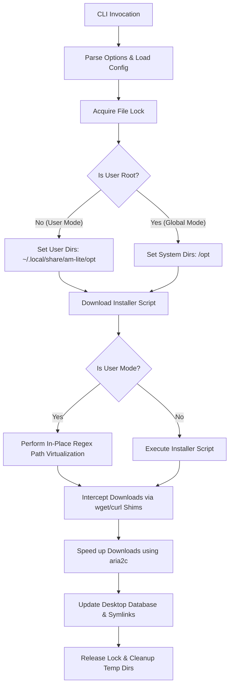

# am-lite

`am-lite` is a production-grade, lightweight systems utility and package manager for AppImages and portable Linux binaries. It interfaces with the [AM database](https://github.com/ivan-hc/AM) of 2500+ application installer scripts, providing high-performance downloading via `aria2c` shims and a secure, non-root user-space virtualization layer.

This utility is designed according to Linux systems engineering and DevOps best practices, featuring process locking, robust signal cleanup, XDG/FHS standards compliance, automated BATS test coverage, and a GitHub Actions CI pipeline.

---

## Architecture & System Design



### Key Engineering Features

1. **User-Space Virtualization (Non-Root Fallback):**
   When executed by a non-root user, `am-lite` automatically falls back to user-space mode. It rewrites downloaded installation scripts dynamically using a precise regex compiler (which targets system paths like `/opt`, `/usr/local/bin`, and `/usr/share/applications` while safely ignoring URLs) to allow installing system-wide AppImages entirely within the user's home folder.
2. **High-Speed Download Hijacking (Wget/Curl Shims):**
   `am-lite` dynamically sets up ephemeral shell wrapper scripts for `wget` and `curl` inside a private temporary directory. It inserts this directory at the front of `PATH` before running the installer script. This intercepts download requests and transparently accelerates them using `aria2c` multi-connection capabilities, falling back to standard curl/wget for metadata queries.
3. **Process Synchronization (File Locking):**
   To prevent concurrent runs from corrupting installations, the utility implements process locking via `flock` on `/run/am-lite.lock` (for system installations) or `~/.local/state/am-lite/am-lite.lock` (for user installations).
4. **Signal Trapping & Resource Hygiene:**
   A robust, unified trap handler listens for `EXIT`, `SIGINT`, and `SIGTERM` signals. It guarantees that all temporary directories, lock files, and executable wrapper scripts are cleanly destroyed, preventing resource leaks.
5. **Structured Logging:**
   The script implements standard log levels (`DEBUG`, `INFO`, `WARN`, `ERROR`), printing colorized output to `stderr` (preserving `stdout` pipeability) and appending raw logs to `/var/log/am-lite.log` or `~/.local/state/am-lite/am-lite.log`.

---

## Installation & Deployment

### Dependencies
- `bash` (v4.0 or later)
- `curl`
- `aria2`
- `bc`
- `sudo` (optional, for system-wide mode)

### Easy Automated Installer
Install `am-lite` with a single command without cloning the repository.

For user-space installation (non-root):
```bash
curl -fsSL https://raw.githubusercontent.com/jerrygoodboi/am-lite/main/install.sh | bash
```

For system-wide installation:
```bash
curl -fsSL https://raw.githubusercontent.com/jerrygoodboi/am-lite/main/install.sh | sudo bash
```

### Standard Installation (from Source)
Clone the repository and run:
```bash
sudo make install
```

### Uninstallation
Clean up all installed system assets:
```bash
sudo make uninstall
```

---

## Commands & Usage

```bash
am-lite [global options] <command> [arguments]
```

### Commands
- `-i, install <app>...` : Install one or more applications.
- `-r, remove <app>...`  : Uninstall one or more applications.
- `-u, update [app...]`   : Check and install updates for specified applications (or all).
- `-s, search <query>`    : Search the AM database.
- `-l, list`              : List all installed applications.
- `-h, help`              : Show detailed usage guidelines.

### Global Options
- `-y, --yes`              : Non-interactive mode (automatically answer yes to prompts).
- `-g, --global, --system` : Force system-wide installation (requires root/sudo).
- `-c, --config <file>`    : Load alternative configuration file.
- `--verbose`              : Enable verbose debug logging.
- `-V, --version`          : Show version details.

---

## Configuration

Configurations are loaded hierarchically:
1. System-wide configuration at `/etc/am-lite.conf`.
2. User configuration at `~/.config/am-lite/config`.
3. CLI override configuration via `-c` / `--config`.

See `am-lite.conf.example` for details on available variables (e.g. `INSTALL_LOCATION`, `MAX_CONNECTIONS`, `LOG_LEVEL`).

---

## Quality Assurance & DevOps Testing

### Linting
Validate shell script standards using `ShellCheck`:
```bash
make lint
```

### Automated Integration Testing
`am-lite` is backed by a comprehensive test suite written in the `BATS` (Bash Automated Testing System) framework. The suite isolates the tool inside a sandbox and intercepts `curl` commands using mock handlers to test package lookup, user-space directory creation, path translation, uninstallation, and logging without internet queries or root privileges.

To run the test suite:
```bash
make test
```

### Continuous Integration (CI/CD)
The project includes a GitHub Actions configuration (`.github/workflows/ci.yml`) that triggers on every commit or PR. It automatically spins up a clean Linux host, runs `ShellCheck`, configures the `BATS` environment, installs dependencies, and runs the test suite to ensure main branch stability.
